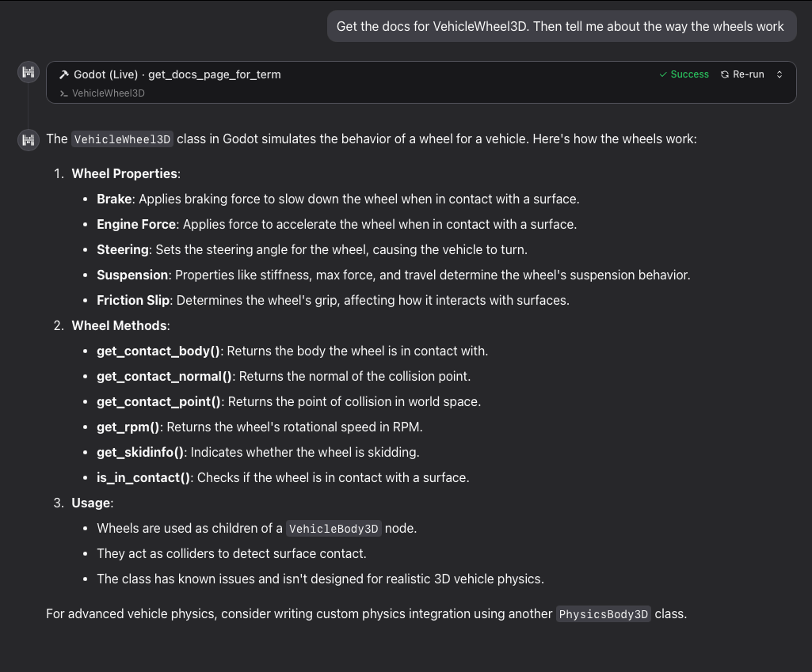

# Godot Docs MCP — Local On-Demand



**Local, on-demand stdio MCP server for Godot documentation search and retrieval.**

Search Godot docs (titles + full page content) without needing to pre-start any server. Your AI client (Grok Build, Claude, Cursor, etc.) spawns the process only when it needs the tools and can shut it down when idle.

- **Fully local by default** after a one-time `npm run download-docs latest` (or any supported version).
- Search indexes are always local (committed in the repo).
- Page content can be served from a local Markdown cache (populated by the download script) or fetched on-demand and auto-cached.
- Supports `stable`, `latest`, `4.6`, `4.5`, `4.4`, and `4.3`. "latest" is ideal for dev builds.

**Based on / adapted from the excellent original work at https://github.com/james2doyle/godot-docs-local-mcp (credit to James Doyle).** This version focuses on simple local stdio + on-demand usage + optional full-offline cache instead of (or in addition to) the Cloudflare-hosted remote path.

## Supported Godot Documentation Versions

The server (and the `download-docs` script) officially support these versions:

- `stable`
- `latest` (recommended for dev / non-stable builds)
- `4.6`
- `4.5`
- `4.4`
- `4.3`

The committed `src/indexes/<version>/` directories provide the search metadata (titles/URLs) for all of them out of the box. Run `npm run download-docs <version>` (defaults to `latest`) to also populate a full local content cache under `local-docs/<version>/` for completely offline use.

## Tools

**search_docs** `(searchTerm: string, version: "stable" | "latest" | "4.6" | "4.5" | "4.4" | "4.3" = "stable")`

> Search the Godot docs by term. Returns (local or remote) URLs to the documentation for each matching term.

**get_docs_page_for_term** `(searchTerm: string, version: "stable" | "latest" | "4.6" | "4.5" | "4.4" | "4.3" = "stable")`

> Get the Godot docs content by term. Returns the full documentation page (from local cache if available, otherwise fetched + auto-cached) for the first matching result.

## Quick Start (Local On-Demand)

1. Clone this repository to a permanent location on your machine.
2. `cd godot-docs-local-mcp && npm install`
3. (Strongly recommended for "latest" / dev builds or full offline) `npm run download-docs latest`
4. (For global client configs such as `~/.grok/config.toml`) copy `.env.example` to `.env` (gitignored), edit `GODOT_DOCS_MCP_PATH` to point at this clone, and `source .env` (or use direnv for auto-load). This keeps your personal config portable instead of hard-coding absolute paths.
5. Add the server to your AI client's MCP configuration (examples below). Use the **direct tsx binary** (after `npm install`) so there is no stdout pollution and the process starts cleanly on demand.

The server is **on-demand by design**: configure it as a stdio server in your client and the client will automatically spawn the Node/tsx process only when it needs to call `search_docs` or `get_docs_page_for_term`. No manual `npm run dev` or background server is required.

### Dependencies (names only)

After cloning, run `npm install`. This pulls in everything needed. The main things you need on your system are:

- Node.js (v22 or later recommended)
- npm

(The project then provides tsx, @modelcontextprotocol/sdk, minisearch, turndown + plugin, zod, etc.)

### Grok Build (Grok TUI)

Grok Build loads from `~/.grok/config.toml`, project `.grok/config.toml` (git root or cwd), and `.mcp.json` (among others).

This repo includes both a project `.grok/config.toml` **and** `.mcp.json` so the local stdio server is automatically available whenever your working directory is inside the checkout.

Global / manual example (add to `~/.grok/config.toml`):

**Important:** For global configs (outside any project), do **not** use a relative path like `"./node_modules/.bin/tsx"`. Grok resolves relative commands (containing `./` etc.) relative to the directory of the config file or Grok's own working directory — **not** the `cwd` you specify below. This is why a relative command can end up looking in `~/.grok/` or similar.

**Recommended:** Use an environment variable (Grok expands `${VAR}` and `${VAR:-default}` from your current environment when loading the config). Set it once in your shell profile (e.g. `~/.bashrc`, `~/.zshrc`, or via direnv). A `.env.example` is provided in this repo — copy it to `.env` (which is gitignored) and edit the path, then `source .env` or use direnv to auto-load when you `cd` into the clone.

```sh
export GODOT_DOCS_MCP_PATH="/absolute/path/to/your/local/clone/godot-docs-local-mcp"
```

Then in `~/.grok/config.toml`:

```toml
[mcp_servers.godot-docs]
command = "npx"
args = ["tsx", "src/stdio.ts"]
cwd = "${GODOT_DOCS_MCP_PATH}"
enabled = true
```

(When inside the repo the project's own `.grok/config.toml` takes precedence and can safely use a relative path like `"./node_modules/.bin/tsx"` because Grok sets the working directory to the project root before resolving commands from project-scoped configs. The path in your global `~/.grok/config.toml` must always point to *your* local install of the clone.)

You can also use the CLI (run from inside the clone, or use the env var + absolute paths):

```sh
grok mcp add godot-docs --command npx --args "tsx,src/stdio.ts" --cwd "${GODOT_DOCS_MCP_PATH:-/path/to/your/clone/godot-docs-local-mcp}"
```

(After setting `export GODOT_DOCS_MCP_PATH=...` as described above.)

See the Grok documentation for the `/mcps` modal (refresh with `r` after editing configs) and `grok mcp doctor`.

### Claude Code (CLI)

Run this once from any directory, substituting your actual clone path:

```powershell
claude mcp add --scope user --transport stdio godot-docs -- npm run dev:stdio --prefix  \path\to\your\clone\godot-docs-local-mcp
```

`--scope user` makes the server available across all your Claude Code sessions. Verify it registered with `claude mcp list`, then start a new session and run `/mcp` to confirm the tools are live.

If `--prefix` doesn't resolve correctly on your system, the fallback:

```powershell
claude mcp add --scope user --transport stdio godot-docs -- cmd /c "cd \path\to\your\clone\godot-docs-local-mcp && npm run dev:stdio"
```

### Claude Desktop

Config file location:
- **Windows:** `%APPDATA%\Claude\claude_desktop_config.json`
- **macOS:** `~/Library/Application Support/Claude/claude_desktop_config.json`

Add a `mcpServers` key at the top level. Use fully-qualified absolute paths to `tsx` and `stdio.ts` — do **not** use a relative path or rely on `cwd`, as Claude Desktop on Windows does not reliably honor the `cwd` field.

**Windows** (use `.cmd` extension, backslash-escaped):

```json
{
  "mcpServers": {
    "godot-docs": {
      "command": "C:\\absolute\\path\\to\\godot-docs-local-mcp\\node_modules\\.bin\\tsx.cmd",
      "args": ["C:\\absolute\\path\\to\\godot-docs-local-mcp\\src\\stdio.ts"]
    }
  }
}
```

**macOS / Linux:**

```json
{
  "mcpServers": {
    "godot-docs": {
      "command": "/absolute/path/to/godot-docs-local-mcp/node_modules/.bin/tsx",
      "args": ["/absolute/path/to/godot-docs-local-mcp/src/stdio.ts"]
    }
  }
}
```

Replace both path occurrences with your actual clone location. Restart Claude Desktop after saving.

### Cursor, Windsurf, Cline, Roo, and other MCP clients

Most modern agents support the standard stdio format:

```json
{
  "mcpServers": {
    "godot-docs": {
      "command": "/absolute/path/to/godot-docs-local-mcp/node_modules/.bin/tsx",
      "args": ["src/stdio.ts"],
      "cwd": "/absolute/path/to/godot-docs-local-mcp"
    }
  }
}
```

Many clients also auto-discover a `.mcp.json` file in your workspace root (this repo provides one that points at the local stdio server).

### Generic / Other Clients

Any client that supports MCP stdio servers can use the same pattern. The key is pointing at the `tsx` binary (shipped in `node_modules/.bin` after `npm install`) + `src/stdio.ts`, preferably with the repo root as the working directory.

**Recommended for portability:** Set the env var `GODOT_DOCS_MCP_PATH` (see Grok section above) and use:

```bash
npx tsx "${GODOT_DOCS_MCP_PATH:-/path/to/godot-docs-local-mcp}/src/stdio.ts"
```

Or with full paths:

```bash
/path/to/godot-docs-mcp/node_modules/.bin/tsx /path/to/godot-docs-local-mcp/src/stdio.ts
```

## Fully Local / Offline Documentation (No Network for Content)

By default the server will still reach out to the internet the first time a page is requested (and then cache the Markdown in memory for the lifetime of the process, plus persist it to `local-docs/`).

For a completely offline experience (or to get fresh content for "latest" while on a dev build):

```sh
npm run download-docs          # defaults to "latest"
npm run download-docs latest
npm run download-docs 4.3
```

What the script does:
- Refreshes `src/indexes/<version>/searchindex.js.json` (search metadata).
- **Replaces** the entire `local-docs/<version>/` tree with fresh Markdown converted from the live Godot docs site.
- After the script finishes, `get_docs_page_for_term` will serve content from the local files with zero network calls.

`local-docs/` is gitignored (it is large and user-specific). Re-run the script any time you want to replace the cache with a fresh pull.

This is especially useful when tracking "latest" for a non-stable Godot dev build.

### How this works

The docs site uses a frontend search tool to handle the docs search. There is a file called `searchindex.js` in the docs site that contains an index of all the pages (URLs and titles, not content) on the site.

This project takes advantage of that in the following ways:

- downloads each of those `searchindex.js` files for each version of the docs
- converts the `searchindex.js` to a `searchindex.js.json` that is just json we need
- indexes that new json using [lucaong/minisearch](https://github.com/lucaong/minisearch)
- when a docs page is requested, the URL for the page is converted from HTML to markdown

## Local Development & Debugging

```sh
npm install
npm run dev:stdio          # run the local stdio server directly (recommended)
npm run download-docs      # populate/refresh full local content cache (optional but great for offline)
```

To debug the server you can use the official inspector:

```sh
npx @modelcontextprotocol/inspector
# then point it at the stdio command (or the http endpoint if you are testing the worker)
```

You can also use https://www.mcpplayground.io/ for quick inspection of a running HTTP instance.

## Advanced: Self-host a Remote Instance on Cloudflare (Optional)

The original project was designed around Cloudflare Workers + the Agents framework for a public hosted endpoint. You can still do that if you want a zero-local-process remote server (subject to rate limits on the public instance).

See the original repository for the full deploy instructions: https://github.com/james2doyle/godot-docs-mcp

After you deploy your own worker, configure clients with the http form:

```json
{
  "mcpServers": {
    "godot-docs": {
      "type": "http",
      "url": "https://godot-docs-mcp.YOUR-SUBDOMAIN.workers.dev/mcp"
    }
  }
}
```

Or via mcp-remote stdio bridge if your client only supports stdio:

```json
{
  "mcpServers": {
    "godot-docs": {
      "command": "npx",
      "args": ["mcp-remote", "https://godot-docs-mcp.YOUR-SUBDOMAIN.workers.dev/mcp"]
    }
  }
}
```

You can adjust (or remove) the rate limit by editing `wrangler.jsonc` before deploying.

The `start-godot-docs.sh` wrapper in this repo is legacy and only useful if you want to run the full Cloudflare worker dev server + mcp-remote bridge locally for testing the HTTP path.
